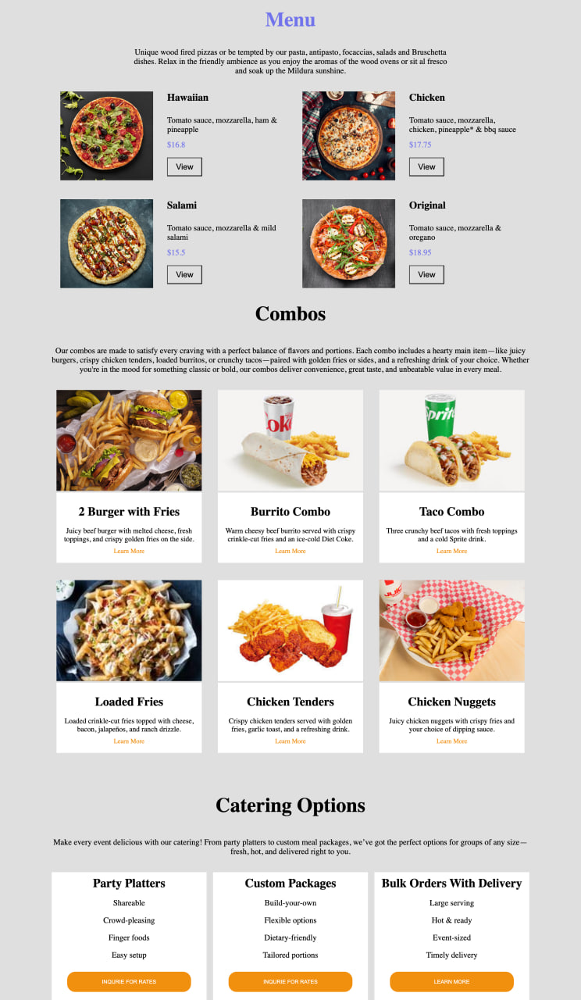

# 🍽️ Restaurant Menu

Welcome to the **Restaurant** project — a modern, responsive menu webpage built with **pure HTML5 and CSS3** (no frameworks or libraries). This project displays a variety of food items including pizzas, combos, and catering options in a clean and user-friendly layout.

🔗 **Live Demo**: [narek-melkumyan.github.io/Restaurant](https://narek-melkumyan.github.io/Restaurant)

📂 **Repository**: [github.com/Narek-Melkumyan/Restaurant](https://github.com/Narek-Melkumyan/Restaurant)

---

## 📋 Project Description

This project showcases a fully responsive restaurant menu page, perfect for food businesses or portfolio examples. It highlights:

- 🍕 Pizza section with item descriptions and prices
- 🍟 Combo meals with pictures and details
- 🍱 Catering options for events
- 📱 Mobile-first responsive design
- 💡 Clean layout using CSS Flexbox and Grid

---

## 🚀 Features

- ✅ Fully responsive across all devices (mobile, tablet, desktop)
- ✅ Built with only HTML and CSS
- ✅ Clean and semantic HTML structure
- ✅ Flexbox layout
- ✅ Professional design and layout

---

## 💼 About Me

👤 [LinkedIn – Narek Melkumyan](https://www.linkedin.com/in/narek-melkumyan-60164a374/)  
I'm open to freelance projects or full-time opportunities. Feel free to connect or reach out for collaboration or ordering web work.
